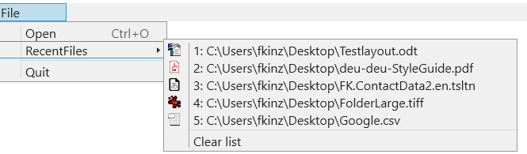

# FolkerKinzel.RecentFiles.WPF
[](https://www.nuget.org/packages/FolkerKinzel.RecentFiles.WPF/)


Recent files menu for WPF applications.
* Displays the file icons automatically.
* Customizable for every language.
* Has its own (asynchronous) persistence mechanism.
* Synchronizes access between multiple threads and multiple instances of the same program.
* Implements an interface to support Dependency Inversion and unit tests (mockable).



```
nuget Package Manager:
PM> Install-Package FolkerKinzel.RecentFiles.WPF -Version 1.3.2

.NET CLI:
> dotnet add package FolkerKinzel.RecentFiles.WPF --version 1.3.2

PackageReference (Visual Studio Project File):
<PackageReference Include="FolkerKinzel.RecentFiles.WPF" Version="1.3.2" />

Paket CLI:
> paket add FolkerKinzel.RecentFiles.WPF --version 1.3.2

F# Interactive:
> #r "nuget: FolkerKinzel.RecentFiles.WPF, 1.3.2"
```

* [Download Reference (English)](https://github.com/FolkerKinzel/RecentFiles.WPF/blob/master/ProjectReference/1.3.2/FolkerKinzel.RecentFiles.WPF.Reference.en.chm)

* [Projektdokumentation (Deutsch) herunterladen](https://github.com/FolkerKinzel/RecentFiles.WPF/blob/master/ProjectReference/1.3.2/FolkerKinzel.RecentFiles.Doku.de.chm)

> IMPORTANT: On some systems, the content of the CHM file is blocked. Before opening the file
>  right click on it, select Properties, and check the "Allow" checkbox - if it 
> is present - in the lower right corner of the General tab in the Properties dialog.


## Example Code
#### Initializing a RecentFilesMenu object: 
```c#
using System.Diagnostics;
using System.Globalization;
using System.IO;
using System.Threading;
using System.Windows;
using FolkerKinzel.RecentFiles.WPF;

namespace WpfExample
{
    /// <summary>
    /// Interaction logic for App.xaml
    /// </summary>
    public partial class App : Application
    {
        private void Application_Startup(object sender, StartupEventArgs e)
        {
            // The example initializes a new RecentFilesMenu which persists its data in
            // the same directory, where the program exe-file is. The constructor has 
            // optional parameters to substitute the text "Clear list" to something in
            // another language and to control the maximum number of files to be displayed.
            string persistenceDirectoryPath =
                Path.GetDirectoryName(Process.GetCurrentProcess().MainModule!.FileName)!;
            var rfm = new RecentFilesMenu(persistenceDirectoryPath);

            new MainWindow(rfm).Show();
        }
    }
}

```

#### Including RecentFilesMenu into a WPF-Window: 

```c#
using System;
using System.Collections.Concurrent;
using System.ComponentModel;
using System.IO;
using System.Runtime.CompilerServices;
using System.Threading.Tasks;
using System.Windows;
using System.Windows.Input;
using FolkerKinzel.RecentFiles.WPF;
using Microsoft.Win32;

namespace WpfExample
{
    /// <summary>
    /// Interaction logic for MainWindow.xaml
    /// </summary>
    public sealed partial class MainWindow : Window, INotifyPropertyChanged
    {
        public event PropertyChangedEventHandler? PropertyChanged;

        private readonly ConcurrentBag<Task> _tasks = new ConcurrentBag<Task>();
        private readonly IRecentFilesMenu _recentFilesMenu;
        private string? _currentFile;


        public MainWindow(IRecentFilesMenu recentFilesMenu)
        {
            this._recentFilesMenu = recentFilesMenu;
            InitializeComponent();
        }


        public string? CurrentFile
        {
            get => _currentFile;
            private set
            {
                _currentFile = value;
                OnPropertyChanged();

                if (value != null)
                {
                    // Adds the current file to the RecentFilesMenu.
                    // If the RecentFilesMenu already contains the file,
                    // it's moved now to the first position.
                    _tasks.Add(_recentFilesMenu.AddRecentFileAsync(value));
                }
            }
        }


        private void Window_Loaded(object sender, RoutedEventArgs e)
        {
            // Assign the RecentFilesMenu the MenuItem next to which the 
            // RecentFilesMenu is to be displayed:
            _recentFilesMenu.Initialize(_miRecentFiles);

            // Register at the RecentFilesMenu.RecentFileSelected event, to open
            // the file, that the user has selected in the RecentFilesMenu:
            _recentFilesMenu.RecentFileSelected += RecentFilesMenu_RecentFileSelected;
        }


        private async void Window_Closed(object sender, EventArgs e)
        {
            // Wait all tasks to be finished before disposing the
            // recent files menu:
            await Task.WhenAll(_tasks.ToArray()).ConfigureAwait(false);
            _recentFilesMenu.Dispose();
        }


        private void Quit_Click(object sender, RoutedEventArgs e) => Close();


        private void RecentFilesMenu_RecentFileSelected(
            object? sender,
            RecentFileSelectedEventArgs e) => OpenFile(e.FileName);


        private void Open_Executed(object sender, ExecutedRoutedEventArgs e)
        {
            var dialog = new OpenFileDialog();

            if (dialog.ShowDialog(this) == true)
            {
                OpenFile(dialog.FileName);
            }
        }


        private void OpenFile(string fileName)
        {
            try
            {
                //  Open the file here!
            }
            catch (IOException)
            {
                _tasks.Add(_recentFilesMenu.RemoveRecentFileAsync(fileName));
                CurrentFile = null;
                return;
            }

            CurrentFile = fileName;
        }


        private void SaveAs_Executed(object sender, ExecutedRoutedEventArgs e)
        {
            var dialog = new SaveFileDialog();

            if (CurrentFile != null)
            {
                dialog.InitialDirectory = Path.GetDirectoryName(CurrentFile);
                dialog.FileName = Path.GetFileName(CurrentFile);
            }

            if (dialog.ShowDialog(this) == true)
            {
                try
                {
                    //  Save the file here!

                    CurrentFile = dialog.FileName;
                }
                catch (IOException)
                {

                }
            }
        }


        private void OnPropertyChanged([CallerMemberName] string propName = "")
            => PropertyChanged?.Invoke(this, new PropertyChangedEventArgs(propName));
    }
}
```


